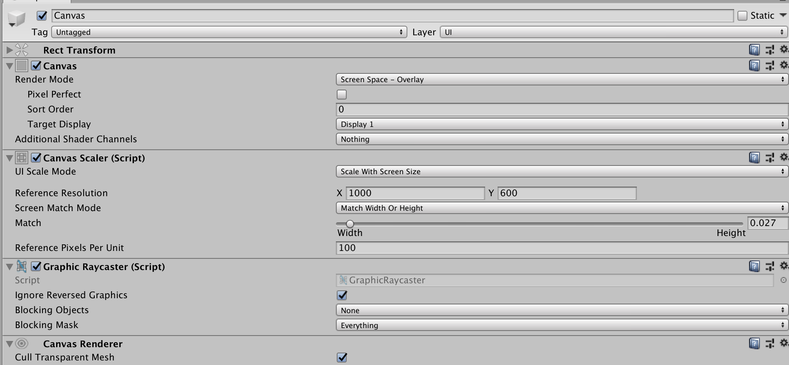
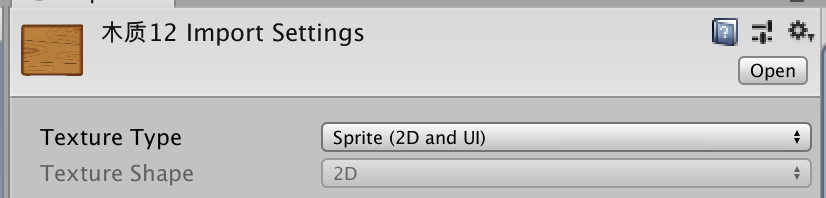
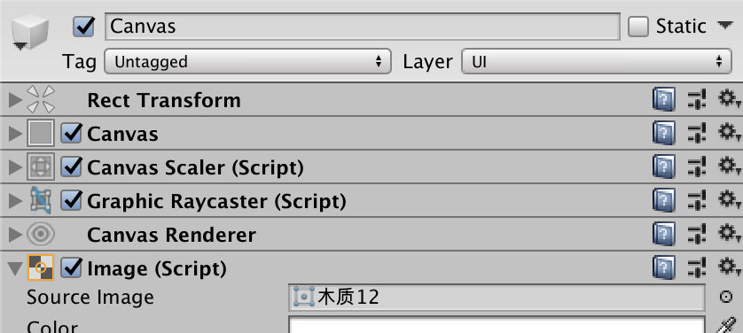
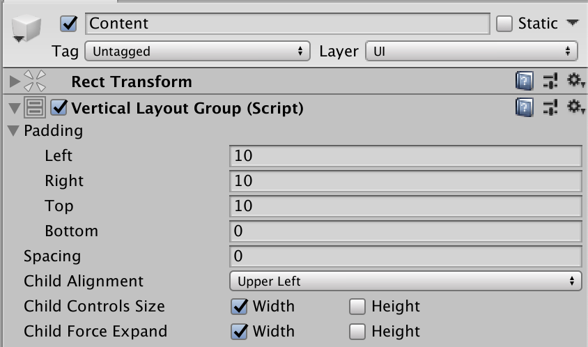
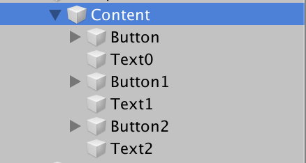
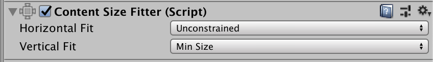
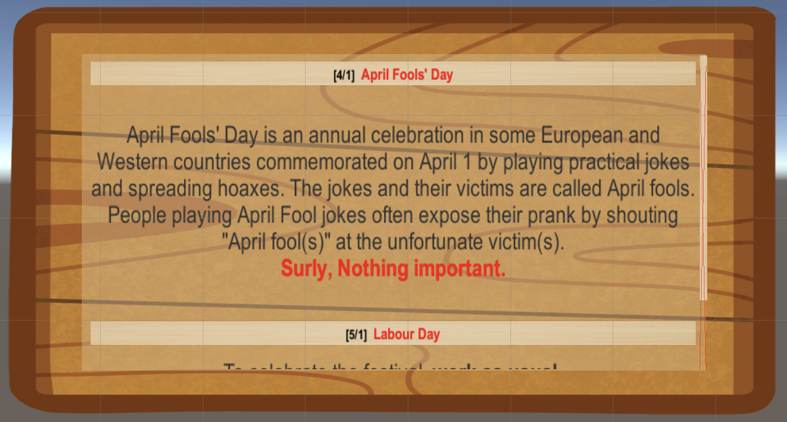

### 使用UGUI实现一个公告板

- IMGUI（Immediate Mode GUI）及时模式图形界面。它是代码驱动的 UI 系统，没有图形化设计界面，只能在 OnGUI 阶段用 GUI 系列的类绘制各种 UI 元素，因此 UI元素只能浮在游戏界面之上。之前游戏里的UI基本用的都是IMGUI，样子不怎么好看但是写起来方便。

- UGUI 是面向对象的 UI 系统。所有 UI 元素都是游戏对象，友好的图形化设计界面， 可在场景渲染阶段渲染这些 UI 元素。对设计师很友好。

  

#### 创建画布

首先要创建一块画布，设置它的各种属性并给它设置一个背景图片。



设置一个公告板的背景图片，只需要找一个公告板拖进Assets，然后修改TextureType为Sprite（2D and UI）。



就可以在Image里选择来用了。




#### 添加UI元素-Scroll View

滚动视图里包括一个显示信息的区域和它对应的滚动条。


##### 信息区域

给ViewPort的Content添加一个VerticalLayoutGroup组件，让里面的内容垂直分布。



并为Content创建三个Button和Text子对象，然后，将 Button 的 Transition 设置成 None。



##### 滚动条

滚动条是直接添加Scorllbar。同时我们希望它能根据内容长度产生对应变化，给 Content 添加 Content Size Fitter 组件，可以实现自适应（因为Content和bar是同一个scrollview的）。



---

布局完成后的静态效果。




#### 展开与折叠的动画

通过协程改变文本框的高度来做出折叠和打开的效果。

##### 展开

```c#
IEnumerator TextVisible() {
    float y = 0;
    for (int i = 0; i < frame; ++i) {
    	  y += height / frame;
      	text.rectTransform.SetInsetAndSizeFromParentEdge(RectTransform.Edge.Right, 0, text.rectTransform.sizeDelta.x);//文本高度变换
      	text.rectTransform.SetInsetAndSizeFromParentEdge(RectTransform.Edge.Bottom, 0, y);
    		if (i == 0) {
        		text.gameObject.SetActive(true);
    		}
    		yield return null;
    }
}
```

##### 折叠

```c#
IEnumerator TextCollapsed() {
    float y = height;
    for (int i = 0; i < frame; ++i) {
      	y -= height / frame;
      	text.rectTransform.SetInsetAndSizeFromParentEdge(RectTransform.Edge.Right, 0, text.rectTransform.sizeDelta.x);
      	text.rectTransform.SetInsetAndSizeFromParentEdge(RectTransform.Edge.Bottom, 0, y);
      	if (i == frame - 1) {
        		text.gameObject.SetActive(false);
      	}
      	yield return null;//暂缓一帧
    }
}
```

##### 点击按钮

点击的时候只用判断active状态然后执行对应的操作即可。

```c++
void OnClick() {
    if (text.gameObject.activeSelf) {
      	StartCoroutine(TextCollapsed());
    } else {
      	StartCoroutine(TextVisible());
    }
}
```